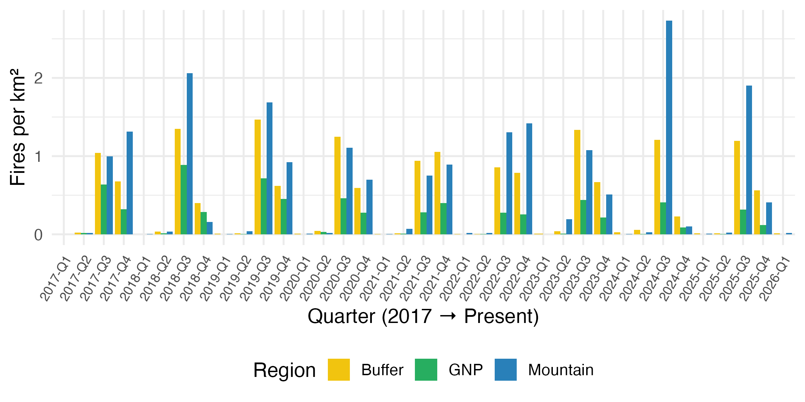
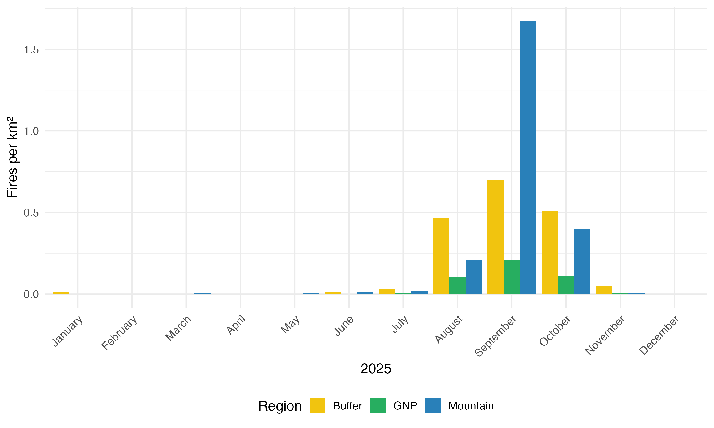

# Gorongosa VIIRS Fire Detection & Analysis 🛰️🔥

This repository contains a modular R pipeline for processing, analyzing, and visualizing active fire data from the **VIIRS (Visible Infrared Imaging Radiometer Suite)** sensor within the **Gorongosa National Park (GNP)** region, including the Mountain and Buffer zones.

The project has been optimized for high performance using spatial indexing and efficient point-in-polygon joins, significantly reducing processing time for multi-year datasets.

---

## Project Structure

### Analysis Scripts (Root)
- **`build_latest_dataset.R`** — The main entry point for data preparation. It combines archive and NRT data to create cached `.rds` files for specific years or the entire range.
- **`plot_fires_per_year_quarter_and_region.R`** — Generates multi-year quarterly bar plots (2017–Present) showing fire density (Fires/km²) across main regions.
- **`plot_fires_per_region_monthly.R`** — Generates monthly fire density breakdowns for a selected target year (e.g., 2025).
- **`build_archive_cache.R`** — A utility script to force-rebuild the historical archive cache from raw CSV files.

### Modular Library (`/R/` folder)
Core logic is separated into functional modules for better maintainability:
- **`viirs_regions.R`** — Loads shapefiles and performs geometric operations to define Gorongosa National Park (*GNP*), Serra da Gorongosa (*Mountain*), and the Sustainable Development Zone (*Buffer*).
- **`viirs_summary.R`** — Contains high-performance spatial join functions to aggregate fire detections into temporal summaries.
- **`viirs_archive.R`** — Dedicated loaders for historical data.
- **`viirs_nrt.R`** — Dedicated loaders for near real-time data.
- **`viirs_combine.R`** — Handles deduplication and schema alignment when merging different VIIRS data sources.
- **`viirs_sf.R`** — Converts raw data frames into spatial (`sf`) objects with proper CRS and date handling.

---

## Required Data Inputs

#### Shapefiles (`shapefiles/`)
The scripts expect the following boundaries:
- `gorongosa_boundary_west_straight_utm.shp` — GNP boundary  
- `gnp_mountain_boundary_latlong.shp` — Gorongosa Mountain boundary  
- `gnp_buffer_latlong_2014.shp` — Park buffer zone (2014)

#### VIIRS Raw Data (`fire_moz_archive/` & `fires_moz_current_year/`)
- `YYYY_Mozambique_SUOMI_VIIRS_C2.csv` — Annual archive files.
- `2026_fire_nrt.csv` — Latest Near Real-Time data from NASA FIRMS.

---

## Outputs Created

The scripts utilize a `cache/` system to avoid redundant spatial calculations:
- **`.rds` files** — Compressed, high-speed spatial data objects for rapid loading.
- **Quarterly Plots** — Visual comparisons of fire density by region (2017–Present).
- **Monthly Plots** — Detailed breakdowns for specific fire seasons.

### Quarterly Fire Density (2017–Present)

  
*Figure 1.* Quarterly fire density (fires per km²) across Gorongosa National Park (GNP), Mountain, and Buffer zones from 2017 to present.

### Monthly Fire Density (2025)

  
*Figure 2.* Monthly fire density (fires per km²) across Gorongosa National Park (GNP), Mountain, and Buffer zones for the year 2025.

---

## Requirements

R packages required to run this pipeline:

```r
install.packages(c("sf", "dplyr", "lubridate", "readr", "ggplot2", "data.table"))
```

---

## How to Download VIIRS Raw Data from NASA FIRMS

Follow these steps to obtain CSV data from **NASA FIRMS** (Fire Information for Resource Management System).

### Step 1: Create an Earthdata Account
Register at [NASA Earthdata Login](https://urs.earthdata.nasa.gov/). You must be logged in to request archive data.

### Step 2: Access the Archive Download Tool
Go to the [FIRMS Archive Download Tool](https://firms.modaps.eosdis.nasa.gov/download/).

### Step 3: Configure Your Request
- **Area of Interest**: Select "Country" (Mozambique).
- **Satellite/Sensor**: Choose **VIIRS S-NPP** (Recommended for long-term consistency).
- **Date Range**: Enter your desired range (e.g., 2017-01-01 to Present).
- **File Format**: Select **CSV**.

### Step 4: Submit and Download
Place the resulting CSVs into the `fire_moz_archive/` directory, or in `fire_moz_current_year/` directory if they are recent NRT files. Ensure they follow the naming convention `YYYY_Mozambique_SUOMI_VIIRS_C2.csv` for the automation to detect them. If you are downloading more recent data to update the results, use the `YYYY_fire_nrt.csv` convention.

### NASA FIRMS Tutorial
[](https://www.youtube.com/watch?v=xGGDMO8OTuw)

---

## Citation

If you use this repository or data, please cite it as follows:

d'Oliveira Coelho, J. 2026. Gorongosa VIIRS Fire Detection & Analysis Pipeline. *GitHub*, https://github.com/Delvis/Gorongosa_FireDetection 